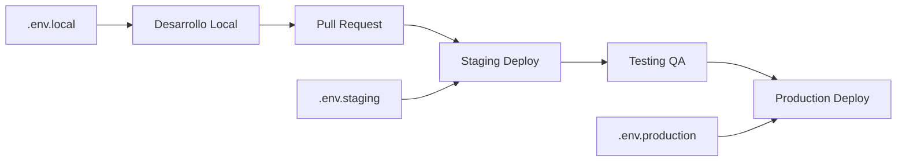

# 🚀 UTalk Frontend

> **Plataforma de comunicación empresarial moderna construida con React, TypeScript y Vite**

[](https://github.com/username/utalk-frontend/actions)
[](https://www.typescriptlang.org/)
[](https://reactjs.org/)
[](https://vitejs.dev/)

## 📋 Tabla de Contenidos

- [🚀 Inicio Rápido](#-inicio-rápido)
- [🔒 Seguridad y Entornos](#-seguridad-y-entornos)
- [🏗️ Arquitectura](#️-arquitectura)
- [📦 Tecnologías](#-tecnologías)
- [🔧 Configuración](#-configuración)
- [📁 Estructura del Proyecto](#-estructura-del-proyecto)
- [🛠️ Desarrollo](#️-desarrollo)
- [🧪 Testing](#-testing)
- [🚀 Deployment](#-deployment)
- [📖 Guías](#-guías)
- [🤝 Contribución](#-contribución)

## 🚀 Inicio Rápido

### Prerequisitos
- **Node.js** 18.0+ ([Descargar](https://nodejs.org/))
- **npm** 9.0+ (incluido con Node.js)
- **Git** ([Descargar](https://git-scm.com/))

### Instalación

```bash
# 1. Clonar el repositorio
git clone https://github.com/username/utalk-frontend.git
cd utalk-frontend

# 2. Instalar dependencias
npm install

# 3. Configurar variables de entorno
cp .env.example .env.local
# Editar .env.local con tus configuraciones locales

# 4. Iniciar servidor de desarrollo
npm run dev
```

### Comandos Principales

```bash
# Desarrollo
npm run dev          # Servidor de desarrollo
npm run build        # Build de producción
npm run preview      # Preview del build
npm run lint         # Linting con ESLint
npm run lint:fix     # Auto-fix de linting
npm test            # Ejecutar tests
npm test:coverage   # Tests con coverage

# Análisis y Performance
npm run build:analyze    # Build con análisis de bundle
npm run bundle:analyze   # Analizar bundle y abrir reporte
npm run performance:check # Lighthouse audit
npm run type-check      # Verificación de tipos TypeScript
npm run audit:deps      # Auditoría de dependencias
npm run audit:security  # Auditoría de seguridad

# Limpieza
npm run clean         # Limpiar cache y build
npm run clean:all     # Limpieza completa y reinstalación
```

---

## 🔒 Seguridad y Entornos

### **🔐 Principios de Seguridad**

UTalk Frontend sigue las **mejores prácticas de seguridad enterprise**:

- ✅ **Variables de entorno** para toda configuración sensible
- ✅ **Headers de seguridad** configurados automáticamente
- ✅ **TypeScript estricto** para prevenir errores en runtime
- ✅ **Validación de entrada** con Zod schemas
- ✅ **Content Security Policy** estricta
- ✅ **Sin secretos hardcodeados** en el código fuente

### **🌍 Configuración de Entornos**

#### **Archivos de Configuración**

```
├── .env.example          # ✅ Template documentado (commitear)
├── .env.local           # 🔒 Desarrollo local (NO commitear)
├── .env.staging         # 🔒 Configuración staging (NO commitear)
└── .env.production      # 🔒 Configuración producción (NO commitear)
```

#### **Configuración por Entorno**

| Entorno | Archivo | URL API | Log Level | Analytics | DevTools |
|---------|---------|---------|-----------|-----------|----------|
| **Local** | `.env.local` | `http://localhost:8000` | `debug` | ❌ | ✅ |
| **Staging** | `.env.staging` | `https://api-staging.utalk.com` | `info` | ✅ | ✅ |
| **Producción** | `.env.production` | `https://api.utalk.com` | `warn` | ✅ | ❌ |

#### **Variables Críticas**

```env
# 🔗 ENDPOINTS (OBLIGATORIOS)
VITE_API_URL=https://api.utalk.com
VITE_WS_URL=wss://ws.utalk.com

# 🔒 SEGURIDAD
VITE_TOKEN_EXPIRY_MINUTES=30
VITE_TOKEN_REFRESH_MINUTES=25
VITE_ENABLE_2FA=true

# 📊 MONITOREO
VITE_SENTRY_DSN=https://your-sentry-dsn@sentry.io
VITE_GA_TRACKING_ID=GA-XXXXXXXXX
```

### **⚠️ Reglas de Seguridad CRÍTICAS**

#### **🚫 NUNCA Hacer**
```bash
# ❌ NO commitear archivos con datos reales
git add .env.production

# ❌ NO hardcodear URLs en el código
const API_URL = 'https://api.utalk.com' // MAL

# ❌ NO exponer claves privadas
VITE_SECRET_KEY=abc123 // MAL - se expone en el navegador
```

#### **✅ SIEMPRE Hacer**
```bash
# ✅ Usar variables de entorno
const API_URL = import.meta.env.VITE_API_URL

# ✅ Validar configuración al inicio
const config = validateConfig()

# ✅ Usar diferentes valores por entorno
VITE_API_URL=https://api-staging.utalk.com # staging
VITE_API_URL=https://api.utalk.com         # producción
```

### **🛡️ Headers de Seguridad Implementados**

```http
X-Frame-Options: DENY
X-Content-Type-Options: nosniff  
X-XSS-Protection: 1; mode=block
Referrer-Policy: strict-origin-when-cross-origin
Permissions-Policy: camera=(), microphone=(), geolocation=()
Strict-Transport-Security: max-age=31536000; includeSubDomains
Content-Security-Policy: default-src 'self'; script-src 'self' 'unsafe-inline'...
```

### **🔍 Auditoría de Seguridad**

#### **Comandos de Verificación**
```bash
# Buscar hardcodes peligrosos
npm run audit:hardcodes

# Verificar configuración de seguridad
npm run audit:security

# Analizar dependencias vulnerables
npm audit

# Verificar variables de entorno
npm run validate:env
```

#### **Checklist de Seguridad**
- [ ] ✅ Sin URLs hardcodeadas
- [ ] ✅ Variables de entorno configuradas
- [ ] ✅ Headers de seguridad activos
- [ ] ✅ HTTPS en producción
- [ ] ✅ CSP configurada
- [ ] ✅ Dependencias actualizadas
- [ ] ✅ Logs de seguridad activos

### **🚀 Configuración de Deployment**

#### **Vercel (Recomendado)**
```bash
# 1. Configurar variables en Vercel Dashboard
# Project Settings → Environment Variables

# 2. Variables por entorno
VITE_API_URL        # Diferente por entorno
VITE_WS_URL         # Diferente por entorno  
VITE_ENV            # development/staging/production
VITE_SENTRY_DSN     # Mismo para staging/prod
```

#### **Netlify**
```bash
# 1. Archivo netlify.toml
[build.environment]
  VITE_API_URL = "https://api.utalk.com"
  VITE_ENV = "production"

# 2. Variables sensibles en dashboard
# Site Settings → Environment Variables
```

#### **Docker**
```dockerfile
# Variables de entorno en Dockerfile
ENV VITE_API_URL=https://api.utalk.com
ENV VITE_ENV=production

# O usando secrets
COPY --from=secrets /run/secrets/env .env.production
```

### **📋 Flujo de Trabajo Recomendado**

#### **Desarrollo → Staging → Producción**



#### **Pasos del Workflow**

1. **Desarrollo Local**
   ```bash
   cp .env.example .env.local
   # Editar con valores locales
   npm run dev
   ```

2. **Pull Request**
   ```bash
   git checkout -b feature/nueva-funcionalidad
   # Nunca commitear archivos .env con datos reales
   git add . --exclude="*.env"
   ```

3. **Staging**
   ```bash
   # Auto-deploy desde main/develop
   # Variables configuradas en plataforma
   ```

4. **Producción**
   ```bash
   # Deploy manual o auto desde main
   # Variables de producción verificadas
   ```

### **🚨 Respuesta a Incidentes**

#### **Si se expone información sensible:**

1. **Inmediato (0-5 min)**
   ```bash
   # Rotar claves expuestas
   # Revocar tokens comprometidos
   # Cambiar URLs si es necesario
   ```

2. **Corto plazo (5-30 min)**
   ```bash
   # Actualizar variables de entorno
   # Desplegar nueva versión
   # Verificar logs de acceso
   ```

3. **Seguimiento (30+ min)**
   ```bash
   # Auditar accesos
   # Documentar incidente
   # Mejorar procesos
   ```

---

## 🏗️ Arquitectura

UTalk Frontend sigue una **arquitectura modular y escalable**:

```
src/
├── components/         # Componentes reutilizables
│   ├── ui/            # Sistema de diseño base
│   └── common/        # Componentes compartidos
├── modules/           # Módulos de negocio
│   ├── crm/          # Gestión de contactos
│   ├── agents/       # Gestión de agentes
│   └── knowledge/    # Base de conocimiento
├── hooks/            # Custom hooks
├── contexts/         # Context API
├── services/         # Servicios de API
├── types/            # Tipos TypeScript
├── lib/              # Utilidades y configuración
└── assets/           # Recursos estáticos
```

### Principios Arquitectónicos

- **🔧 Modularidad**: Cada módulo es independiente y reutilizable
- **📱 Responsive First**: Diseño mobile-first con Tailwind CSS  
- **⚡ Performance**: Lazy loading y code splitting
- **🔒 Type Safety**: TypeScript estricto en toda la aplicación
- **🧪 Testing**: Cobertura de tests unitarios y de integración
- **♿ Accessibility**: Cumple estándares WCAG 2.1

---

## 📦 Tecnologías

### Core Stack
- **React 18.2+** - Librería UI con Concurrent Features
- **TypeScript 5.0+** - Tipado estático y herramientas de desarrollo
- **Vite 4.4+** - Build tool ultra-rápido con HMR
- **Tailwind CSS 3.3+** - Framework CSS utility-first

### UI & Experiencia
- **Radix UI** - Componentes primitivos accesibles
- **Lucide React** - Iconografía moderna y consistente
- **React Hook Form** - Formularios performantes
- **Zod** - Validación de esquemas TypeScript-first

### Estado y Datos
- **Context API** - Estado global de la aplicación
- **React Router 6+** - Routing declarativo
- **Axios** - Cliente HTTP con interceptors

### Desarrollo y Calidad
- **ESLint** - Linting y reglas de código
- **Prettier** - Formateo automático de código
- **Husky** - Git hooks para calidad
- **GitHub Actions** - CI/CD automatizado

---

## 🔧 Configuración

### Variables de Entorno

Copia `.env.example` a `.env.local` y configura:

```env
# API Configuration
VITE_API_URL=http://localhost:8000
VITE_WS_URL=ws://localhost:8080

# Environment
VITE_ENV=development
VITE_LOG_LEVEL=debug

# Security
VITE_TOKEN_EXPIRY_MINUTES=60
VITE_TOKEN_REFRESH_MINUTES=50

# Application
VITE_APP_NAME=UTalk
VITE_APP_VERSION=1.0.0
```

### Configuración TypeScript

El proyecto usa **TypeScript estricto**:

```json
{
  "strict": true,
  "noUnusedLocals": true,
  "noUnusedParameters": true,
  "noImplicitAny": true
}
```

---

## 📁 Estructura del Proyecto

```
utalk-frontend/
├── 📄 README.md                    # Documentación principal
├── 📄 package.json                 # Dependencias y scripts
├── 📄 tsconfig.json                # Configuración TypeScript
├── 📄 vite.config.ts               # Configuración Vite
├── 📄 tailwind.config.js           # Configuración Tailwind
├── 📄 .env.example                 # Template de variables
│
├── 📁 .github/workflows/           # CI/CD con GitHub Actions
│   └── ci.yml                      # Pipeline principal
│
├── 📁 src/                         # Código fuente
│   ├── 📁 components/              # Componentes reutilizables
│   │   ├── ui/                     # Sistema de diseño
│   │   │   ├── button.tsx          # Componente botón
│   │   │   ├── card.tsx            # Componente tarjeta
│   │   │   ├── input.tsx           # Componente input
│   │   │   └── icons.ts            # Sistema de iconos optimizado
│   │   └── common/                 # Componentes compartidos
│   │       ├── LoadingSpinner.tsx  # Spinner de carga
│   │       └── AuthWrapper.tsx     # Wrapper de autenticación
│   │
│   ├── 📁 modules/                 # Módulos de negocio
│   │   ├── crm/                    # CRM y contactos
│   │   │   ├── components/         # Componentes del CRM
│   │   │   ├── hooks/              # Hooks específicos
│   │   │   ├── services/           # Servicios de API
│   │   │   └── types/              # Tipos del módulo
│   │   ├── agents/                 # Gestión de agentes
│   │   └── knowledge/              # Base de conocimiento
│   │
│   ├── 📁 hooks/                   # Custom hooks globales
│   │   ├── useAuth.ts              # Hook de autenticación
│   │   └── useTheme.ts             # Hook de tema
│   │
│   ├── 📁 contexts/                # Context API
│   │   ├── AuthContext.tsx         # Contexto de autenticación
│   │   └── ThemeContext.tsx        # Contexto de tema
│   │
│   ├── 📁 services/                # Servicios de API
│   │   └── apiClient.ts            # Cliente HTTP configurado
│   │
│   ├── 📁 types/                   # Tipos TypeScript globales
│   │   ├── index.ts                # Tipos principales
│   │   └── shared.ts               # Tipos compartidos
│   │
│   ├── 📁 lib/                     # Utilidades y configuración
│   │   ├── utils.ts                # Utilidades generales
│   │   ├── constants.ts            # Constantes de la app
│   │   ├── validation.ts           # Esquemas de validación
│   │   └── logger.ts               # Sistema de logging
│   │
│   └── 📁 pages/                   # Páginas y routing
│       ├── AppRoutes.tsx           # Configuración de rutas
│       ├── auth/                   # Páginas de autenticación
│       └── DashboardPage.tsx       # Dashboard principal
│
└── 📁 dist/                        # Build de producción (generado)
```

---

## 🛠️ Desarrollo

### Agregar un Nuevo Módulo

1. **Crear estructura**:
```bash
mkdir -p src/modules/mi-modulo/{components,hooks,services}
touch src/modules/mi-modulo/{index.ts,types.ts}
```

2. **Definir tipos** en `types.ts`:
```typescript
import { BaseEntity } from '@/types/shared'

export interface MiEntidad extends BaseEntity {
  nombre: string
  estado: 'activo' | 'inactivo'
}
```

3. **Crear componente principal**:
```typescript
export function MiModuloDashboard() {
  // Implementación
}
```

4. **Exportar en** `index.ts`:
```typescript
export { MiModuloDashboard } from './components/MiModuloDashboard'
export type { MiEntidad } from './types'
```

### Estándares de Código

#### Naming Conventions
- **Componentes**: PascalCase (`UserProfile`)
- **Hooks**: camelCase con prefijo `use` (`useUserData`)
- **Archivos**: kebab-case (`user-profile.tsx`)
- **Constantes**: UPPER_SNAKE_CASE (`API_ENDPOINTS`)

#### Organización de Imports
```typescript
// 1. Librerías externas
import React from 'react'
import { useState } from 'react'

// 2. Componentes UI
import { Button } from '@/components/ui/button'

// 3. Hooks y utilidades
import { useAuth } from '@/hooks/useAuth'

// 4. Tipos
import type { User } from '@/types'

// 5. Relativos
import { MyComponent } from './MyComponent'
```

---

## 🧪 Testing

### Estructura de Tests

```bash
src/
├── components/
│   └── __tests__/              # Tests de componentes
├── hooks/
│   └── __tests__/              # Tests de hooks
└── utils/
    └── __tests__/              # Tests de utilidades
```

### Ejecutar Tests

```bash
# Tests unitarios
npm test

# Tests con coverage
npm run test:coverage

# Tests en modo watch
npm run test:watch

# Tests específicos
npm test -- --testNamePattern="Button"
```

---

## 🚀 Deployment

### Build de Producción

```bash
# 1. Build optimizado
npm run build

# 2. Preview local
npm run preview

# 3. Verificar bundle
npm run bundle:analyze
```

### Deploy Automático

El proyecto se despliega automáticamente:

- **Production**: Push a `main` → Vercel Production
- **Staging**: Push a `develop` → Vercel Preview  
- **Feature**: Pull Request → Vercel Preview

### Variables de Producción

Configurar en Vercel/plataforma:

```env
VITE_API_URL=https://api.utalk.com
VITE_WS_URL=wss://ws.utalk.com
VITE_ENV=production
VITE_LOG_LEVEL=warn
```

---

## 📖 Guías

### Agregar Nueva Página

1. **Crear componente**:
```typescript
// src/pages/MiPagina.tsx
export function MiPagina() {
  return <div>Mi nueva página</div>
}
```

2. **Agregar ruta**:
```typescript
// src/pages/AppRoutes.tsx
const MiPagina = lazy(() => import('./MiPagina'))

// En el JSX
<Route path="/mi-pagina" element={<MiPagina />} />
```

### Manejar Estado Global

```typescript
// 1. Crear contexto
const MiContexto = createContext()

// 2. Crear provider
export function MiProvider({ children }) {
  const [estado, setEstado] = useState()
  return (
    <MiContexto.Provider value={{ estado, setEstado }}>
      {children}
    </MiContexto.Provider>
  )
}

// 3. Hook personalizado
export function useMiContexto() {
  const context = useContext(MiContexto)
  if (!context) throw new Error('useMiContexto debe usarse dentro de MiProvider')
  return context
}
```

### Optimización de Performance

- **Lazy Loading**: Usar `React.lazy()` para componentes grandes
- **Memoización**: `React.memo()` para componentes puros
- **Code Splitting**: Separar chunks por ruta/módulo
- **Tree Shaking**: Imports específicos de librerías

---

## ✅ Checklist de Calidad para Merge a Main

### **🔍 Pre-Merge Checklist**

#### **Código y Funcionalidad**
- [ ] ✅ **Tests pasando**: `npm test` sin errores
- [ ] ✅ **TypeScript limpio**: `npm run type-check` sin errores
- [ ] ✅ **ESLint limpio**: `npm run lint` sin warnings
- [ ] ✅ **Build exitoso**: `npm run build` sin errores
- [ ] ✅ **Funcionalidad probada**: Todas las rutas funcionan

#### **Performance y Bundle**
- [ ] ✅ **Bundle size**: No más de 500KB gzipped
- [ ] ✅ **Lazy loading**: Componentes pesados lazy loaded
- [ ] ✅ **Tree shaking**: Imports optimizados
- [ ] ✅ **No código muerto**: Sin imports/exports sin usar

#### **Seguridad y Configuración**
- [ ] ✅ **Variables de entorno**: Sin hardcodes
- [ ] ✅ **Headers de seguridad**: Configurados correctamente
- [ ] ✅ **Dependencias actualizadas**: `npm audit` sin vulnerabilidades críticas
- [ ] ✅ **Archivos sensibles**: No commitear `.env` con datos reales

#### **Documentación**
- [ ] ✅ **README actualizado**: Con cambios relevantes
- [ ] ✅ **Comentarios**: Código complejo documentado
- [ ] ✅ **Commits descriptivos**: Siguiendo conventional commits

### **🚀 Comandos de Verificación**

```bash
# 1. Verificación completa
npm run lint && npm run type-check && npm test

# 2. Build y análisis
npm run build && npm run bundle:analyze

# 3. Auditoría de seguridad
npm run audit:security

# 4. Performance check
npm run performance:check
```

### **📊 Métricas Objetivo**

| Métrica | Objetivo | Comando de Verificación |
|---------|----------|------------------------|
| **Bundle Size** | < 500KB gzipped | `npm run bundle:analyze` |
| **Lighthouse Score** | > 90 | `npm run performance:check` |
| **TypeScript Errors** | 0 | `npm run type-check` |
| **ESLint Warnings** | 0 | `npm run lint` |
| **Test Coverage** | > 80% | `npm run test:coverage` |
| **Security Vulnerabilities** | 0 críticas | `npm run audit:security` |

### **🔧 Auto-Fix Commands**

```bash
# Limpiar automáticamente
npm run lint:fix          # Auto-fix ESLint
npm run clean             # Limpiar cache
npm audit fix             # Fix vulnerabilidades automáticas
```

---

## 🤝 Contribución

### Workflow de Desarrollo

1. **Fork** del repositorio
2. **Crear rama** feature: `git checkout -b feature/mi-feature`
3. **Implementar** cambios con tests
4. **Commit** siguiendo convenciones: `feat: agregar nueva funcionalidad`
5. **Push** y crear **Pull Request**

### Conventional Commits

```bash
feat: nueva funcionalidad
fix: corrección de bug
docs: actualización de documentación
style: cambios de formato
refactor: refactorización de código
test: agregar o modificar tests
chore: tareas de mantenimiento
```

### Code Review

Antes de merge, verificar:

- ✅ Tests passing
- ✅ Linting sin errores
- ✅ Build exitoso
- ✅ Documentación actualizada
- ✅ Performance sin regresiones

---

## 📞 Soporte

- **Documentación**: Este README y comentarios en código
- **Issues**: [GitHub Issues](https://github.com/username/utalk-frontend/issues)
- **Discussions**: [GitHub Discussions](https://github.com/username/utalk-frontend/discussions)

---

**🚀 ¡Contribuye a UTalk y ayuda a crear la mejor plataforma de comunicación empresarial!** 