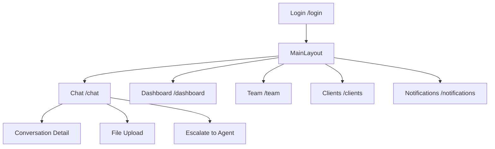

# 01 - ARQUITECTURA UI Y STACK

## 1. Objetivo y alcance

**Objetivo**: Definir cómo está construido el frontend (stack, estructura, convenciones) para **escalar**, **mantener** y **alinear** con el BACK.

**Módulos principales**: Auth, Chat, Conversaciones, Media, IA (sugerencias), KPIs/Reportes, Configuración, Team, Clients, Dashboard.

## 2. Stack y librerías (versiones actuales)

### Core Framework
- **Framework**: React 19.1.1 + Vite 7.1.2
- **Lenguaje**: TypeScript 5.8.3 (strict mode)
- **Ruteo**: React Router DOM 7.8.0

### UI y Estilos
- **CSS Framework**: TailwindCSS 3.4.17
- **Componentes UI**: Radix UI primitives (Dialog, Avatar, Dropdown, etc.)
- **Íconos**: Lucide React 0.539.0
- **Animaciones**: Framer Motion 12.23.12

### Estado y Datos
- **Server State**: TanStack React Query 5.85.0
- **Client State**: Zustand 5.0.7
- **Formularios**: React Hook Form 7.62.0 + Zod 4.0.17
- **HTTP Client**: Axios 1.11.0

### Real-time
- **WebSocket**: Socket.io-client 4.8.1

### Utilidades
- **Fechas**: date-fns 4.1.0
- **Charts**: Recharts 3.1.2
- **Virtualización**: React Window 1.8.11
- **Notificaciones**: React Hot Toast 2.5.2

### Testing
- **Unit/Integration**: Vitest 3.2.4 + Testing Library 16.3.0

## 3. Estructura de carpetas (actual)

```
/src
  /components
    /chat/                    # Componentes específicos del chat
    /dashboard/               # Componentes del dashboard
    /layout/                  # Layouts y sidebars
    /ui/                      # Componentes base (LazyMotion, ToggleSwitch)
  /config
    api.ts, constants.ts, environment.ts, firebase.ts, logger.ts, socket.ts
  /contexts
    AuthContext.tsx, WebSocketContext.tsx, useAuthContext.ts, useWebSocketContext.ts
  /hooks
    /chat/                    # Hooks específicos del chat
    /shared/                  # Hooks compartidos
    /websocket/               # Hooks de WebSocket
    useAI.ts, useAuth.ts, useChat.ts, etc.
  /modules
    /auth/                    # Módulo de autenticación
    /clients/                 # Módulo de clientes
    /dashboard/               # Módulo de dashboard
    /notifications/           # Módulo de notificaciones
    /team/                    # Módulo de equipo
  /services
    api.ts, ai.ts, conversations.ts, messages.ts, etc.
  /stores
    useAuthStore.ts, useChatStore.ts, useClientStore.ts, etc.
  /styles
    chat.css, dashboard.css, copilot.css, etc.
  /types
    client.ts, conversation.ts, message.ts, etc.
  /utils
    cacheUtils.ts, logger.ts, performanceMonitor.ts, etc.
```

## 4. Convenciones establecidas

### TypeScript
- **Configuración**: `"strict": true` en tsconfig.json
- **Nombres**: 
  - Componentes: `PascalCase` (MessageBubble, ChatInput)
  - Hooks: `useCamelCase` (useWebSocket, useAuthStore)
  - Stores: `useXStore` (useAuthStore, useChatStore)
  - Archivos: `kebab-case` (message-bubble.tsx)

### Props y Tipos
- **No `any`**: Todos los props tipados con interfaces
- **Props interfaces**: `ComponentNameProps` (MessageBubbleProps)
- **Validación**: Zod para formularios y validación de datos

### Renders y Performance
- **Componentes puros**: Evitar side-effects fuera de hooks
- **Memoización**: React.memo para componentes pesados
- **Lazy loading**: Para módulos pesados (charts, IA)

### Estilos
- **Tailwind**: Con tokens consistentes (spacing, typography, shadows)
- **CSS Modules**: Para estilos específicos de componentes
- **Responsive**: Breakpoints sm/md/lg/xl

## 5. Seguridad y Auth en Front

### Token Management
- **Almacenamiento**: localStorage para access_token y refresh_token
- **Validación**: Interceptor de Axios para refresh automático
- **Protección**: ProtectedRoute component con redirección a /login

### CORS y Headers
- **Authorization**: `Bearer ${token}` en headers
- **Content-Type**: application/json para requests
- **Rate Limiting**: Implementado en utils/rateLimiter.ts

## 6. Performance Budgets

### Métricas objetivo
- **FCP**: < 1.8s
- **TTI**: < 3s
- **Interaction delay**: < 100ms (p95)

### Optimizaciones implementadas
- **Bundle splitting**: Por módulos (auth, chat, dashboard)
- **Lazy loading**: React.lazy para módulos pesados
- **Virtualización**: React Window para listas largas
- **Memoización**: React.memo y useMemo para componentes costosos

## 7. Ruteo (mapa actual)



## 8. Accesibilidad (A11y)

### Implementado
- **Radix UI**: Componentes accesibles por defecto
- **Focus management**: En modals y dropdowns
- **ARIA labels**: En componentes interactivos
- **Keyboard navigation**: Soporte completo

### Pendiente
- **Contraste**: Verificar ratios ≥ 4.5:1
- **Screen readers**: Testing con lectores de pantalla
- **axe-core**: Integración en testing

## 9. Entornos y variables

### Variables de entorno (.env)
```bash
# API y Backend
VITE_BACKEND_URL=https://tu-backend.railway.app
VITE_API_URL=https://tu-backend.railway.app

# WebSocket
VITE_SOCKET_URL=wss://tu-backend.railway.app

# Firebase (si aplica)
VITE_FIREBASE_API_KEY=xxx
VITE_FIREBASE_AUTH_DOMAIN=xxx
VITE_FIREBASE_PROJECT_ID=xxx

# Analytics (opcional)
VITE_SENTRY_DSN=xxx
```

### Configuración por entorno
- **Development**: .env.local
- **Production**: Variables en Vercel/Railway
- **Testing**: .env.test

## 10. Scripts de desarrollo

### Comandos principales
```bash
# Desarrollo
npm run dev                    # Vite dev server
npm run build                  # Build de producción
npm run preview                # Preview del build

# Quality
npm run lint                   # ESLint
npm run lint:fix               # Auto-fix linting
npm run type-check             # TypeScript check
npm run format                 # Prettier

# Performance
npm run analyze                # Bundle analysis
npm run optimize-imports       # Optimizar imports
npm run clean:logs             # Limpiar console.logs
```

## 11. Integración con Backend

### Endpoints principales
- **Auth**: `/api/auth/login`, `/api/auth/profile`
- **Chat**: `/api/conversations`, `/api/messages`
- **Media**: `/api/media/upload`, `/api/media/proxy`
- **KPIs**: `/api/kpis/*`

### WebSocket Events
- **Client → Server**: `message:send`, `typing:start/stop`
- **Server → Client**: `message:new`, `message:delivered`, `conversation:updated`

## 12. Monitoreo y Observabilidad

### Logging
- **Logger centralizado**: utils/logger.ts
- **Categorías**: API, Auth, WebSocket, UI
- **Performance**: utils/performanceMonitor.ts

### Error Handling
- **ErrorBoundary**: Componente global
- **Toast notifications**: Para errores de usuario
- **Console logging**: Para debugging (limpio en prod) 